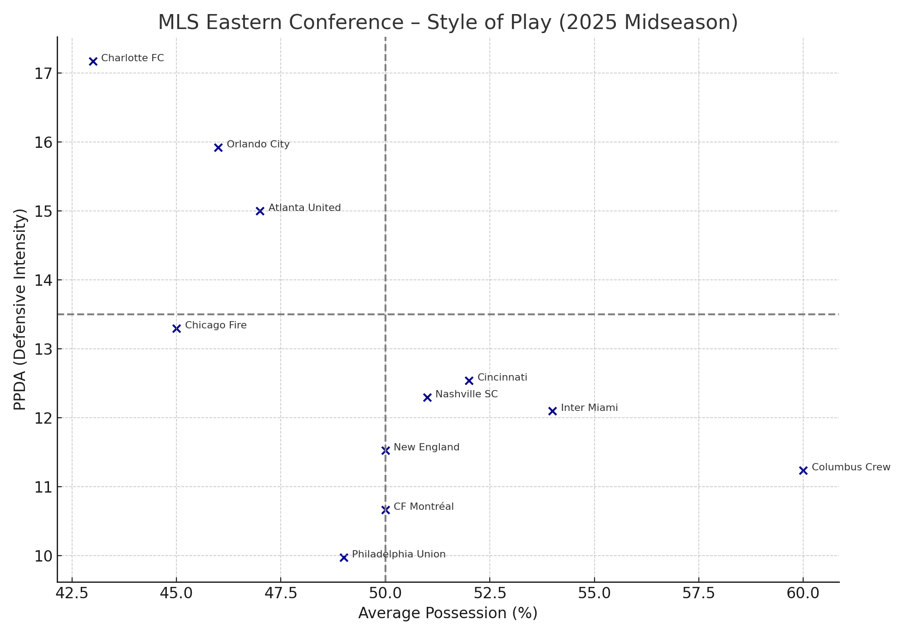
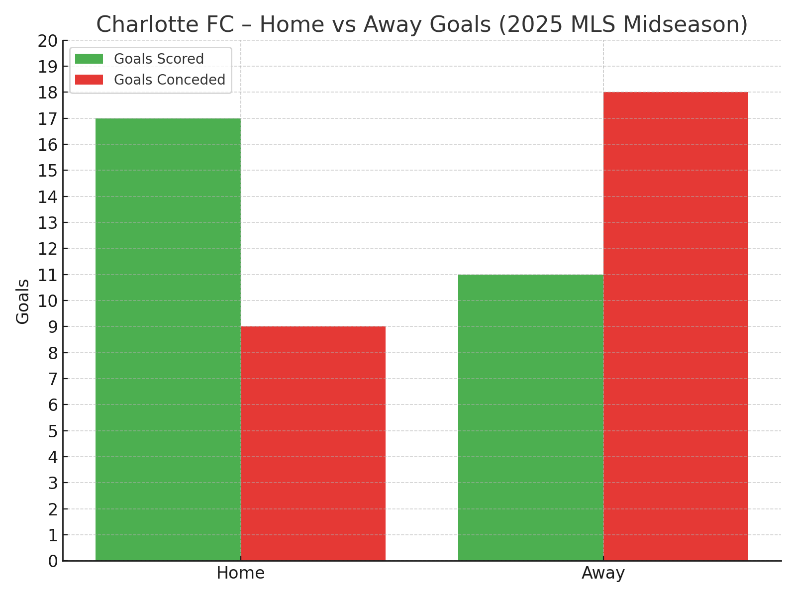
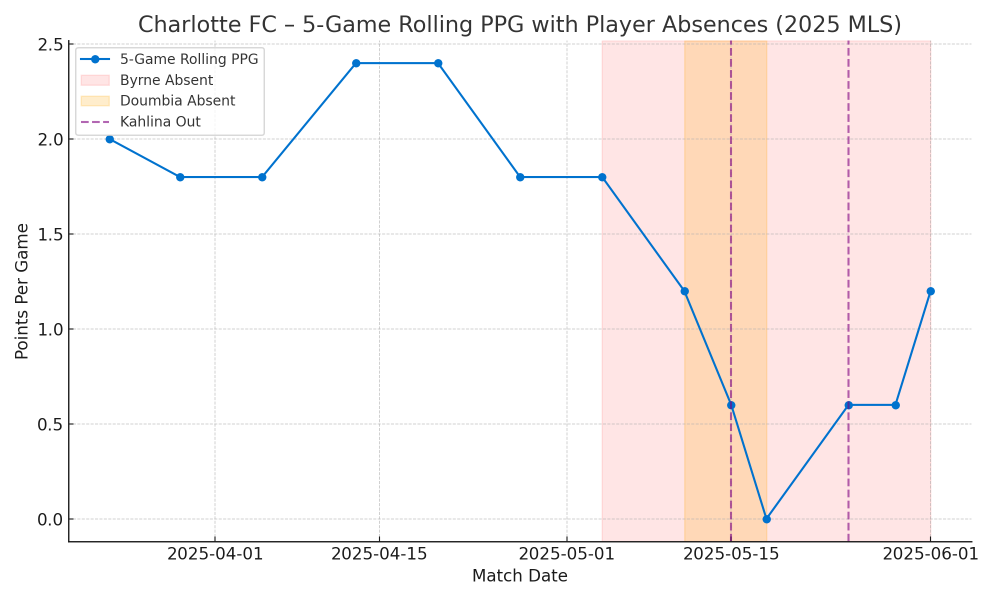

# Charlotte FC 2025 Mid-Season Review

This project presents a mid-season tactical and statistical analysis of Charlotte FC during the 2025 MLS campaign. Built as part of the UNC Charlotte Sports Analytics Practicum, the goal was to extract insights from match data and present findings to Fc's Data Analytics Team.

## 📈 Key Metrics Analyzed
- xG & goal production
- Build-up play: passes to final third, progressive passes
- Defensive engagement: duels, aerials, PPDA
- Tactical shape, player availability, and trends over time

## 🔍 Key Findings

### Home vs Away Split
Charlotte FC is a **playoff-level team at home (6-0-2)** but ranks in the **bottom third on the road (2-1-7)**.

### Tactical Identity
- High **xG** and **progressive pass accuracy**
- **Low pressing intensity** (high PPDA)
- Below-average **aerial duel success**
- Relies on structured build-up and transitions

### Style of Play Comparison
Charlotte FC’s tactical profile (high PPDA, low possession) places them in **Quadrant 1: "Slow build-up, defend mid-block"**.

This quadrant-style graph categorizes teams by **pressing intensity** and **ball control style**:

| Quadrant | Description |
|----------|-------------|
| 🔲 **Top Left** | *Low Possession, Low Pressing* — Teams that sit in a mid/low block and don’t chase the ball aggressively. |
| 🔲 **Top Right** | *High Possession, Low Pressing* — Teams that dominate the ball but defend more passively (possession-focused, slower transitions). |
| 🔲 **Bottom Left** | *Low Possession, High Pressing* — Pressing teams that don’t dominate the ball (counter-pressing or transitional style). |
| 🔲 **Bottom Right** | *High Possession, High Pressing* — Intense, dominant teams that press high and keep the ball (typically elite). |

---

## 📈 Charlotte FC – Strengths & Weaknesses (vs. Eastern Conference Avg)

This table compares Charlotte FC’s midseason metrics to the 2025 Eastern Conference average:

### 🟢 Strengths

| Metric                        | Charlotte FC | East Avg | Insight                                                                 |
|------------------------------|--------------|----------|-------------------------------------------------------------------------|
| **xG**                       | 1.70         | ~1.55    | Top-third chance creation — Charlotte consistently gets quality looks. |
| **Goals**                    | 1.65         | ~1.57    | Finishing aligns with expected output — efficient attacking execution. |
| **Progressive Pass Accuracy**| 73.6%        | ~69.2%   | Among the best in the East — shows precision in moving the ball forward. |
| **Smart Passes / Accurate**  | 1.47         | ~1.45    | Strong use of through balls and line-breaking passes.                  |
| **Average Pass Length**      | 19.89        | ~18.3    | Slightly longer passing style — favors direct buildup over short exchanges. |
| **Match Tempo**              | 17.13        | ~17.0    | Keeps a steady pace, reflective of a structured and intentional style. |

### 🔴 Weaknesses

| Metric                | Charlotte FC | East Avg | Concern                                                                 |
|-----------------------|--------------|----------|-------------------------------------------------------------------------|
| **Aerial Duels Won**  | 22.18        | ~27.8    | Among the lowest in the East — vulnerable on crosses and set pieces.   |
| **PPDA**              | 17.17        | ~13.6    | Applies less defensive pressure — indicates passive, mid-block defending. |
| **Conceded Goals**    | 1.59         | ~1.52    | Slightly elevated — potentially tied to limited pressing and aerial issues. |
| **Defensive Duels Won**| 56.29       | ~59.4    | Slightly below average — opportunity to improve defensive engagement.  |
| **Throw-in Accuracy** | 18.12        | ~18.9    | Minor technical detail, but could affect ball retention.               |

_The Eastern Conference average was computed across all available teams in the dataset (excluding Charlotte FC), and rounded to two decimal places. Metrics were selected based on tactical relevance: goal production, passing progression, defensive pressure, and physical engagement._

### ⚖️ Balanced Metrics

Charlotte sits near the conference average in:

- **Passes to Final Third / Accurate**: 54.94 (East Avg ~54.5)
- **Set Piece Shots**: 23.41 (East Avg ~24)
- **Counterattacks w/ Shots**: 0.94 (East Avg ~0.9)

These are stable but not standout categories, representing maintenance areas rather than focus areas for tactical adjustments.

---

### 🧠 Tactical Takeaways

Charlotte FC plays with a **defend-first mindset**, favoring **direct and intentional ball movement** once possession is gained. Their approach is not about suffocating pressure or controlling the tempo — it’s about absorbing, then attacking.

Key themes:

* They **invite opponents forward**, allowing controlled entry into their defensive third — a calculated trade-off to stay compact and set up transitions.
* Their **progressive passing metrics are elite**, showing the team excels at moving the ball vertically once recovered.
* However, they **lack defensive intensity in midfield** and **struggle in aerial duels**, creating vulnerability on set pieces and second balls.

This tactical identity places Charlotte FC firmly in the **“low possession, low pressing” quadrant**: organized, tough to break down at times, but not proactive without the ball.

---

## 🏟️ Home vs Away Goal Contributions

Charlotte FC’s 2025 MLS season reveals a sharp contrast in performance depending on the venue:

| Venue | Goals Scored | Goals Conceded |
|-------|--------------|----------------|
| 🏠 **Home** | **17**          | **9**              |
| 🛫 **Away** | **11**          | **18**             |

### 🧠 Key Insights:
- Charlotte scores **over 50% more goals at home**, and concedes **twice as few** compared to away matches.
- This suggests stronger defensive organization and more assertive attacking play in home fixtures.
- **Away matches show consistent second-half struggles**, contributing to a -7 goal differential on the road.
- Reinforces the pattern: **playoff-level team at home, vulnerable side away** — with tactical adjustments needed in road fixtures.

---

## 🏥 Injury and Availability Impacts

Charlotte FC’s midseason form was disrupted by the absence of key players during a critical stretch in May 2025:

- 🔴 **Nathan Byrne** (RB): Missed 7+ matches due to neck surgery starting May 4. His absence destabilized the right side and disrupted the 2-3-5 build-up shape.
- 🟠 **Souleyman Doumbia** (LB): Missed 3 matches between May 11–18. Without him, Charlotte lacked overlapping width on the left.
- 🟣 **Kristijan Kahlina** (GK): Missed matches on May 15 and May 25 due to personal leave.

The chart below displays Charlotte FC’s **5-game rolling Points Per Game**, with absences annotated:

### 🧠 Key Insight:
These absences align with dips in team form — particularly in away fixtures. The impact on wide build-up play and defensive structure was clear, as Charlotte conceded more goals and struggled to maintain consistent pressure or rhythm.  

---

## 📊 Featured Visuals
- [x] Style of Play Quadrant Chart (PPDA vs Possession)  
- [x] Charlotte vs. Eastern Conference – Metric Comparison  
- [x] Home vs Away Goal Contributions  
- [x] Injury and availability impacts   

---

## 🙌 Acknowledgments
Special thanks to the Charlotte FC analytics team and the UNC Charlotte Sports Analytics Practicum for the opportunity and support throughout this project.
